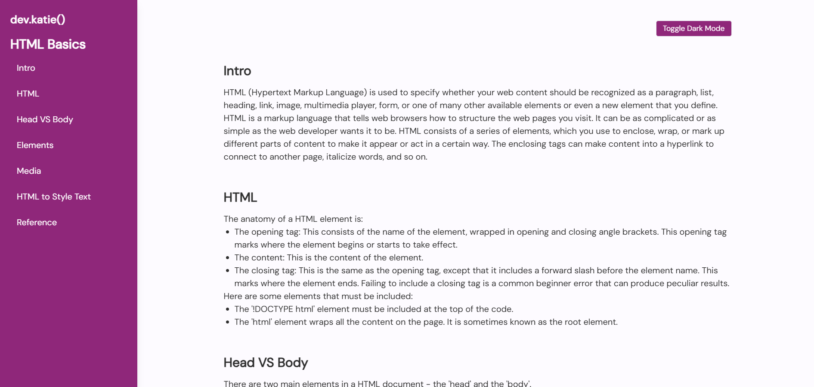
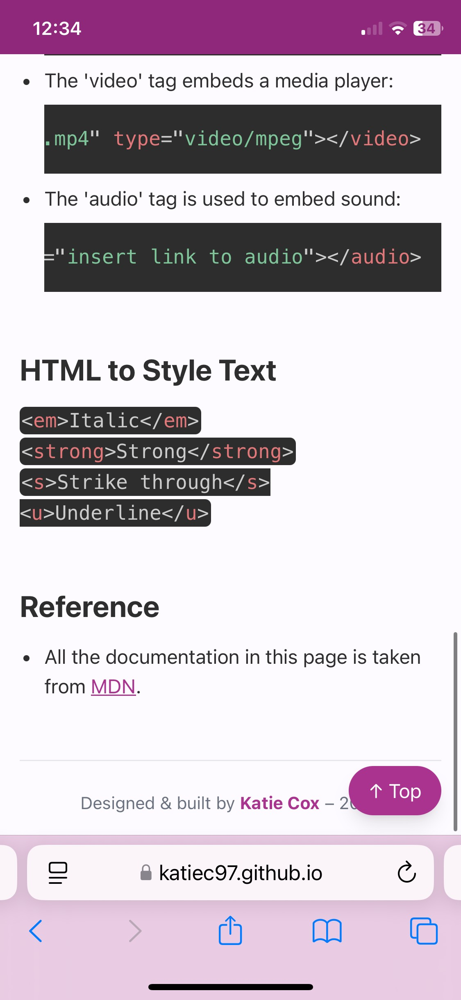

# HTML Technical Documentation Page – dev.katie()

A fully responsive and accessible HTML documentation page built with **Tailwind CSS**, featuring a modern aesthetic with smooth scroll, dark mode toggle, and syntax highlighting via Prism.js.

## Features

- **Responsive layout** with sticky sidebar navigation
- **Smooth scrolling** and active section highlighting (Scrollspy)
- **Dark mode toggle** with themed adjustments
- **Syntax highlighting** using Prism.js for code blocks
- **Mobile hamburger menu** for compact navigation
- **Accessible skip link** for screen readers
- **Scroll-to-top button** for better UX
- Custom color palette using pink/purple tones for a modern, personal brand feel

## Technologies Used

- HTML5
- Tailwind CSS (via CDN)
- JavaScript (vanilla)
- Prism.js for syntax highlighting
- Google Fonts: [DM Sans](https://fonts.google.com/specimen/DM+Sans)

## Live Demo

[View the live site here](https://katiec97.github.io/html-technical-doc-page/)

## Screenshots

### Desktop View

### Mobile View

### Dark Mode

## Author

Designed & built by **Katie Cox** — 2025
[GitHub Profile](https://github.com/KatieC97)
